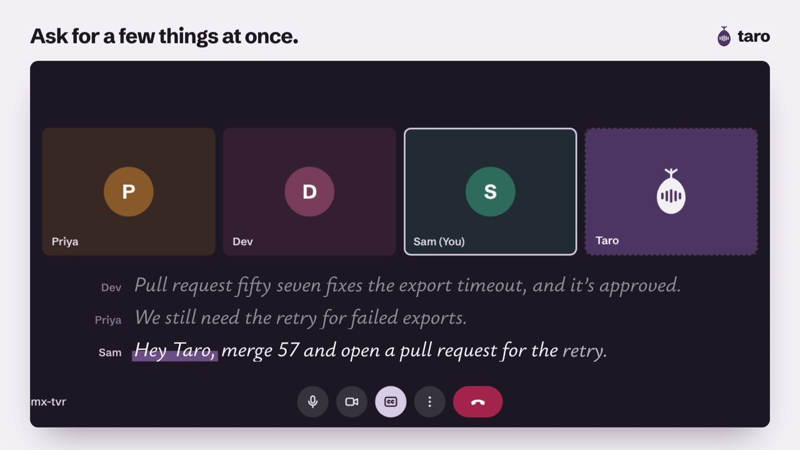

# Taro

Meeting follow-ups get lost. Taro does them before you hang up.

[](https://trytaro.vercel.app/taro-demo.mp4)

[Watch the 46 second demo](https://trytaro.vercel.app/taro-demo.mp4)

Taro joins your Google Meet, Zoom, and Microsoft Teams calls as a guest. When someone says "Hey Taro" and asks for something, Taro does it right away in Slack, GitHub, Linear, or Jira, then plays a short chime in the call so everyone knows it's done. When the call ends, it posts a recap of everything it did.

## Why it exists

Most meetings end with a few promises: "I'll file a ticket for that," "someone should tell engineering," "let's open a PR." Some of them never happen. Taro closes that gap. The person who asks doesn't have to remember, and nobody has to take notes to catch it.

## How it works

1. Taro joins the call. It can come from a meeting on someone's connected Google Calendar, a meeting link posted in Slack, a link pasted in the dashboard, or the Invite Taro button inside Google Meet.
2. Someone asks. "Hey Taro, file an issue about that."
3. Taro does it. It reads the recent conversation, so "that" becomes a written issue about what was actually discussed. It confirms with a chime in the call and a reply in Slack.

## What you can say

| Where | Example |
|---|---|
| Slack | "Hey Taro, tell engineering the deploy is done" |
| Slack checklist | "Hey Taro, make a todo list in projects for the launch, the docs, and QA" |
| GitHub issue | "Hey Taro, file an issue about the export timing out" |
| GitHub pull request | "Hey Taro, open a pull request to fix the reports page" |
| GitHub, more | Comment, label, assign, request a review, close, or merge by number |
| Linear or Jira | "Hey Taro, file a ticket about the invite emails going to spam" |
| Linear or Jira, more | "Close ENG 42," "assign OPS 7 to Priya," "comment on DES 12 that it's approved" |
| A few at once | "Hey Taro, merge 57 and open a pull request for the retry" |

One request can ask for up to three things; Taro does them in order and reports each one. Each workspace chooses which actions Taro may take. Filing and commenting are on from the start; actions that change existing work, like merging or closing, stay off until an owner or admin turns them on.

To send meetings, requests, and transcripts to your own tools, add a webhook in Setup. [docs/WEBHOOKS.md](docs/WEBHOOKS.md) lists the events and shows how to check the signature.

## What you need

Taro runs on your own accounts. Each workspace adds its keys once, and pays its providers directly.

| Piece | Options | What it does |
|---|---|---|
| Meeting bot | [MeetingBaas](https://meetingbaas.com) | Joins the call and streams its audio to Taro |
| AI model | Anthropic, OpenAI, Google, Groq, OpenRouter, or any OpenAI compatible API | Works out what people asked for and writes the result |
| Transcription | Groq Whisper, OpenAI, or a server the operator hosts | Turns speech into text as people talk |
| Tools (optional) | Slack, GitHub, Linear, Jira, webhooks | Where the work lands |

## Security

- Taro acts as its own bot in every tool, never through a person's account.
- Provider keys are checked with the provider, encrypted at rest, and never shown again.
- Each meeting's audio stream and callbacks carry their own secret.
- Meeting audio is never stored.

The full list is in the security notes of [docs/DEPLOY.md](docs/DEPLOY.md#security-notes).

## Project structure

```
apps/web          Next.js: landing page, sign in (Google, Slack), dashboard, demo
apps/extension    Chrome and Edge extension: the Invite Taro button inside Google Meet
apps/jira         The Taro app for Jira, deployed to Atlassian with Forge
packages/api      Express API: auth, provider keys, Slack listener, realtime audio, actions
packages/shared   Types, constants, and the copy both sides use
docs/             Deployment guide, webhooks reference, Slack app manifest, demo poster
```

## Local development

You need Node 22 or newer, pnpm 9, a MongoDB database, a Slack app or a Google sign in client, and a public https URL for the API, since Slack and MeetingBaas call it. A static [ngrok](https://ngrok.com) domain works well.

```bash
pnpm install
cp .env.example .env          # fill in MONGODB_URI, ENCRYPTION_KEY, API_URL, and a sign in method
```

1. Start a tunnel to the API with `ngrok http 4000 --domain=<your-domain>`, and set `API_URL` to that https URL.
2. Create the Slack app from `docs/slack-app-manifest.yaml` with that domain (section 3 of `docs/DEPLOY.md`).
3. Run both apps:

```bash
pnpm --filter @taro/api dev   # http://localhost:4000
pnpm --filter @taro/web dev   # http://localhost:3000
```

4. Open http://localhost:3000, sign in, and follow Setup in the dashboard.

The dashboard calls `http://localhost:4000` by default. Set `NEXT_PUBLIC_API_URL` in `apps/web/.env.local` to change it.

### Tests

```bash
pnpm --filter @taro/api test
pnpm --filter @taro/api typecheck
pnpm --filter @taro/web test
pnpm --filter @taro/web exec tsc --noEmit
```

### Local transcription (optional)

Workspaces normally use Groq or OpenAI for transcription. For offline development, the API can run the sherpa-onnx model in process (`LOCAL_ASR=1`, with model files in `packages/api/models`) or use the faster-whisper server in `packages/api/stt-server` (`STT_WS_URL`).

## Deploying

[docs/DEPLOY.md](docs/DEPLOY.md) covers everything: MongoDB, Slack and Google sign in, Google Calendar, the GitHub app, Linear, Jira, the API on Render, Railway, Fly.io, or Docker, and the dashboard on Vercel.

## Troubleshooting

### Taro doesn't join when a link is posted in Slack

Taro only sees public channels it belongs to. It joins every public channel when it's added to Slack, and `/invite @taro` covers channels made later. Check the API log for `Listening for meeting links via Socket Mode`, and make sure Setup is complete. Taro replies in the thread with anything that's missing.

### Taro joined but nothing happens when people talk

Admit it from the lobby first. Then open the meeting in the dashboard: Hearing now shows what transcription is producing. If it stays empty, check the transcription key.

### A request came back as Needs you

The meeting's request list shows Taro's reason, including provider errors such as a rejected key or a used up quota.

### GitHub, Linear, or Jira actions fail

Make sure a default repository, team, or project is chosen in Setup, and check that tool's permissions. Anything turned off is refused on purpose.

## License

MIT
